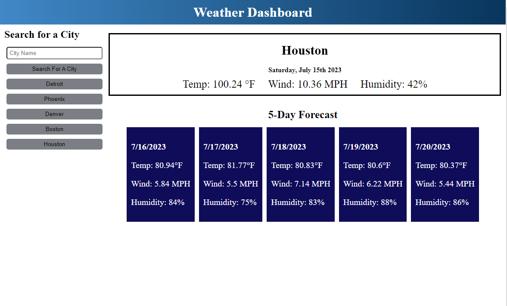

# Weather-Forecast

## Description

The purpose of this program is to be able to pull weather information from an API using an API key and being able to display the information for a user to see. The API provides plenty of information, so we wanted to develop something that would pull the information that is necessary for people to see and use and they would like. From this project, we were able to learn how to traverse through information that was nested deep inside of other objects and how to utilize the information as best we could. 

## Usage

https://github.com/Gramer35/Weather-Forecast

